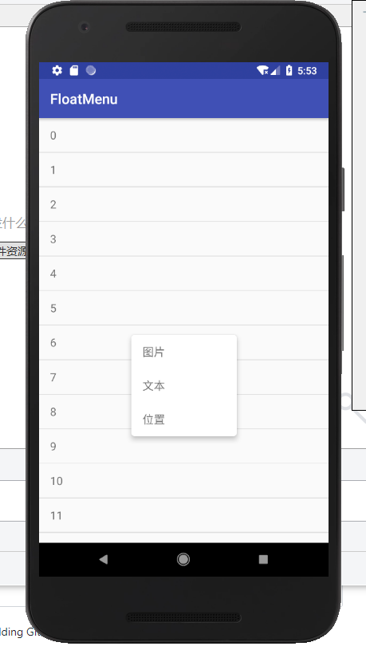

### FloatMenu

popupMenu show as click position

 [介绍](https://blog.csdn.net/a1018875550/article/details/81046259)

### use

- new Point in your activity and Override the method ```dispatchTouchEvent``` to get your click position

```
    private val mPoint = Point()

    override fun dispatchTouchEvent(ev: MotionEvent): Boolean {
        if (ev.action == MotionEvent.ACTION_DOWN) {
            mPoint.x = ev.rawX.toInt()
            mPoint.y = ev.rawY.toInt()
        }
        return super.dispatchTouchEvent(ev)
    }
```

- new FloatMenu

```
lateinit var mFloatMenu: FloatMenu
```

```
    override fun onCreate(savedInstanceState: Bundle?) {
        super.onCreate(savedInstanceState)
        setContentView(R.layout.activity_main)
        //init floatMenu
        mFloatMenu = FloatMenu(this)
        //set menu dataSource
        mFloatMenu.inflate(R.menu.menu_chat)
        //menu item click
        mFloatMenu.mOnMenuItemClickListener = object : OnMenuItemClickListener {
            override fun onMenuItemClick(item: MenuItem) {
                Toast.makeText(applicationContext, item.title, Toast.LENGTH_SHORT).show()
            }
        }
        //set recyclerView data 
        recyclerView.layoutManager = LinearLayoutManager(this)
        recyclerView.addItemDecoration(DividerItemDecoration(this, DividerItemDecoration.VERTICAL))
        var mainAdapter = MainAdapter()
        mainAdapter.onItemClickListener = object : OnItemClickListener {
            override fun itemClick(view: View, position: Int) {
                //show menu
                mFloatMenu.show(view, mPoint.x, mPoint.y)
            }
        }
        recyclerView.adapter = mainAdapter
    }

```

### pic

